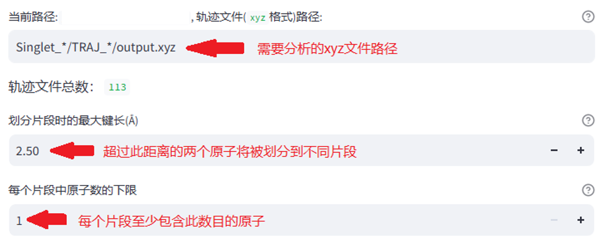
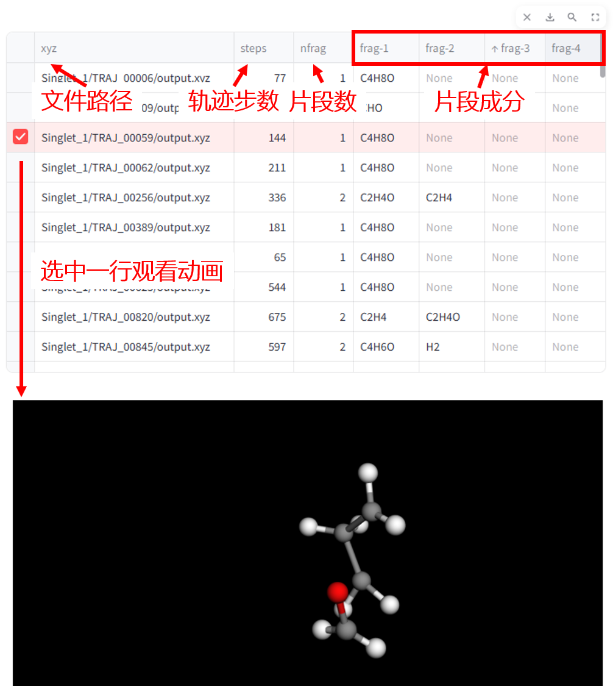

# MolFragApp

## 介绍

MolFragApp 是一个基于Python语言的项目，使用`xyz`格式的分子结构文件进行碎片分析和轨迹可视化。

MolFragApp is a project based on Python language that uses molecular structure files in 'xyz' format for fragmentation analysis and visualization of trajectories

## 使用效果

设置参数:



> [键长](https://baike.baidu.hk/item/%E9%8D%B5%E9%95%B7/2442392)和原子数的设置需要考虑具体的体系和问题。

分析结果:




## 使用方法

### 安装

```shell
# 创建环境
conda create --name molfrag python=3.11
conda activate molfrag

git clone 

# pip freeze > requirements.txt
# 安装依赖
pip install -r requirements.txt
```

### 运行

```shell
# 关闭防火墙(Linux)
systemctl stop firewalld

# 直接运行
streamlit run MolFragApp.py
# 后台运行
nohup streamlit run MolFragApp.py > MolFragApp.log 2>&1 &
```


