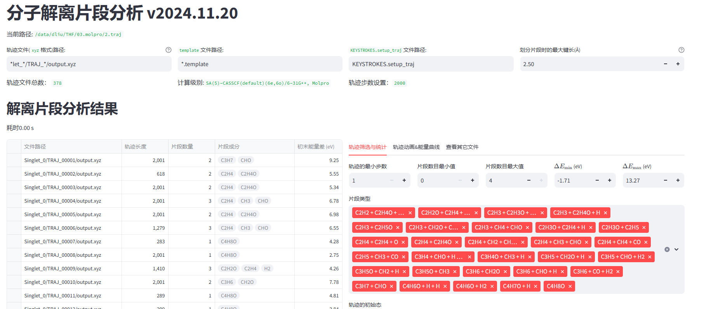
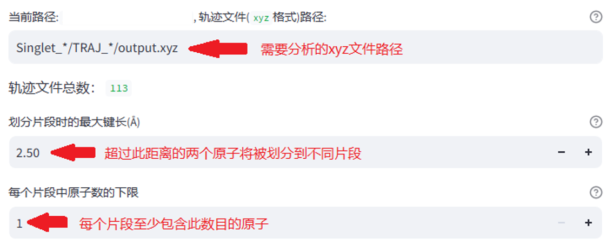
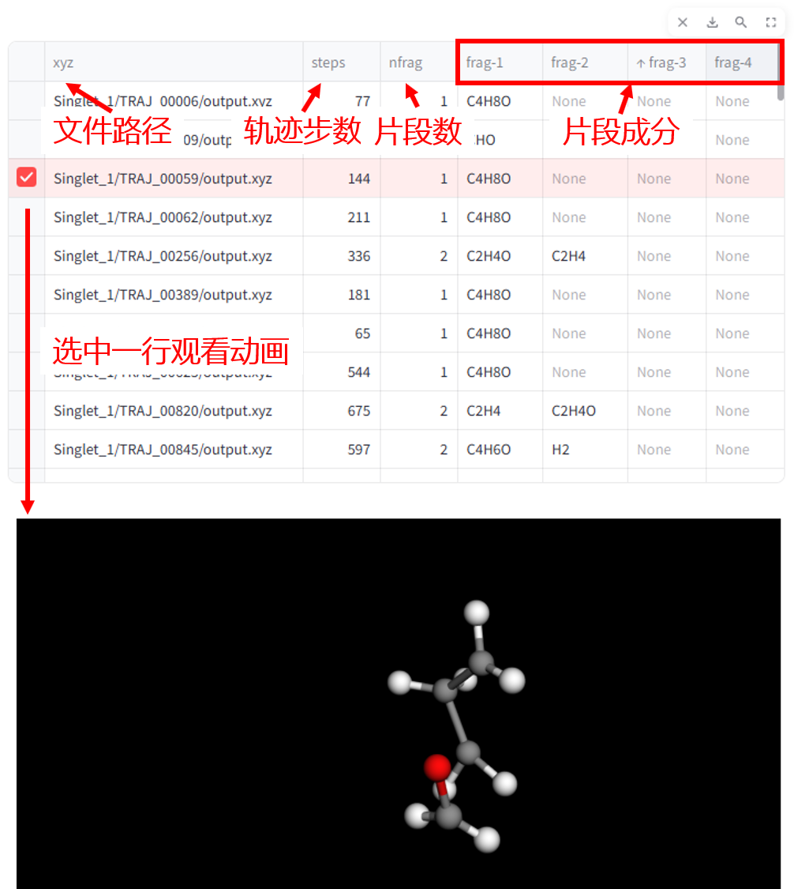
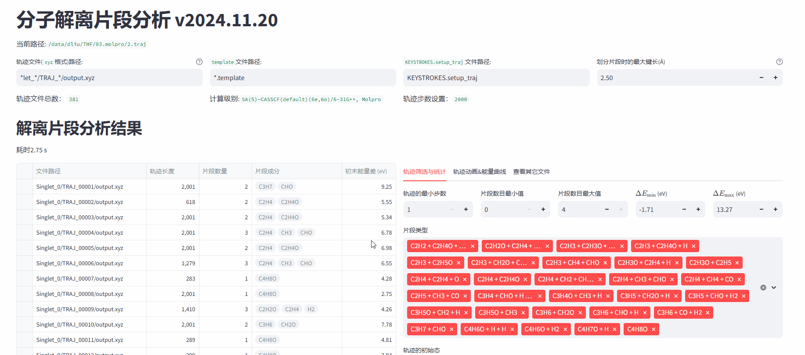
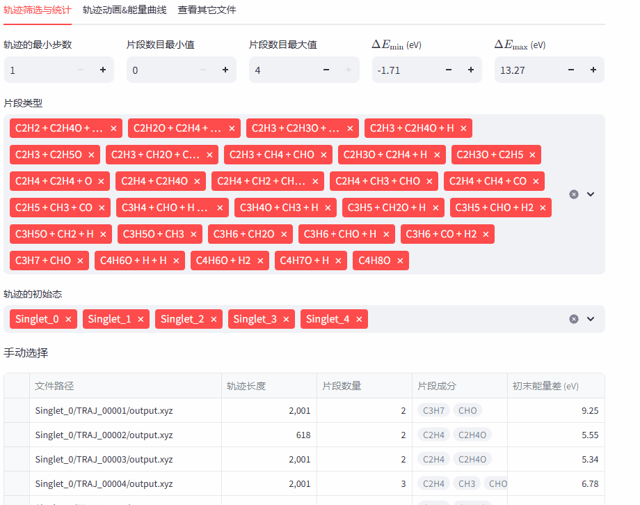
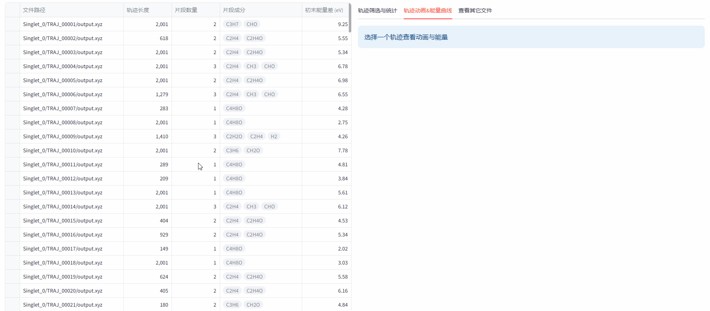
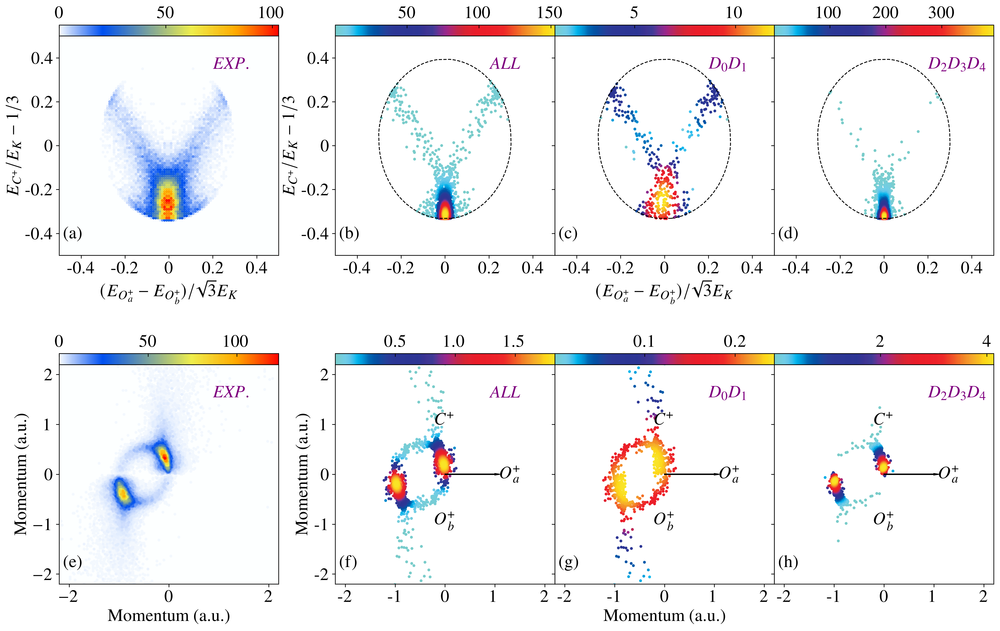
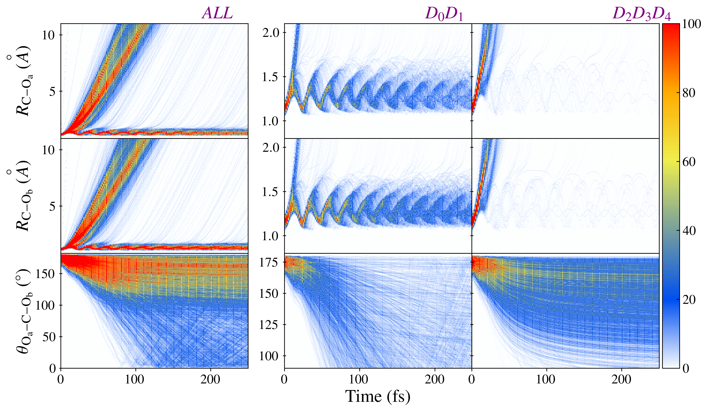

# MolFragApp

<p align="center">
  
</p>

<p align="center">
  <strong>An interactive application for molecular fragmentation analysis and trajectory visualization</strong>
</p>

<p align="center">
  MolFragApp helps researchers analyze fragmentation behavior, inspect trajectory statistics, and visualize molecular evolution directly from <code>xyz</code> trajectory files.
</p>

<p align="center">
  <a href="https://doi.org/10.5281/zenodo.14916038"></a>
  <a href="https://molfragapp.readthedocs.io/en/latest/"></a>
  
  
</p>

---

## Table of Contents

- [Overview](#overview)
- [Why MolFragApp](#why-molfragapp)
- [Key Features](#key-features)
- [Scientific Use Cases](#scientific-use-cases)
- [Input and Output](#input-and-output)
- [Demonstration](#demonstration)
- [Installation](#installation)
- [Quick Start](#quick-start)
- [Example Workflow](#example-workflow)
- [Gallery](#gallery)
- [Documentation](#documentation)
- [FAQ](#faq)
- [Roadmap](#roadmap)
- [Contributing](#contributing)
- [Citation](#citation)
- [License](#license)

---

## Overview

**MolFragApp** is a Python-based interactive application for **molecular fragmentation analysis** and **trajectory visualization**. It is designed for researchers who work with molecular dynamics trajectories and need a practical way to move from raw `xyz` files to interpretable structural, statistical, and visual results.

The application combines:

- **fragmentation analysis**
- **interactive trajectory inspection**
- **multi-trajectory statistics**
- **geometry and energy animation**

into a lightweight workflow built on **Python** and **Streamlit**.

---

## Why MolFragApp

In molecular dynamics studies, especially those involving dissociation or reactive processes, extracting chemically meaningful information from trajectory files can be repetitive and time-consuming. Researchers often need to examine large numbers of trajectories, identify fragmentation channels, compare representative events, and visualize structural evolution in a form suitable for interpretation or presentation.

MolFragApp was developed to simplify this process. It provides a single interface for exploring fragmentation behavior and trajectory evolution without requiring users to build a custom analysis pipeline from scratch.

---

## Key Features

<table>
  <tr>
    <td width="50%">
      <h3>Fragmentation Analysis</h3>
      <p>Analyze molecular fragmentation directly from trajectory structures and follow connectivity changes during dissociation.</p>
    </td>
    <td width="50%">
      <h3>Interactive Visualization</h3>
      <p>Inspect molecular structures and trajectory evolution in a browser-based interface powered by Streamlit.</p>
    </td>
  </tr>
  <tr>
    <td width="50%">
      <h3>Trajectory Statistics</h3>
      <p>Summarize and compare multiple trajectories to identify recurring patterns and representative behaviors.</p>
    </td>
    <td width="50%">
      <h3>Animation Support</h3>
      <p>View geometry and energy evolution dynamically to better understand structural changes over time.</p>
    </td>
  </tr>
</table>

### Highlights

- Designed for **molecular fragmentation analysis**
- Supports **trajectory visualization** from `xyz` files
- Suitable for both **single-trajectory inspection** and **multi-trajectory statistics**
- Useful for **research analysis**, **mechanism exploration**, and **publication-oriented figure preparation**
- Lightweight and easy to deploy locally with **Streamlit**

---

## Scientific Use Cases

MolFragApp is particularly useful for research scenarios such as:

- fragmentation analysis of molecular dynamics trajectories
- dissociation pathway inspection
- comparison of multiple nonadiabatic trajectories
- trajectory screening for representative events
- visualization of structural evolution in reactive dynamics
- preparation of figures and animations for publications or presentations

Typical application areas include:

- nonadiabatic molecular dynamics ([SHARC4.0 | Surface Hopping including Arbitrary Couplings](https://sharc-md.org/))
- photodissociation studies
- Coulomb explosion dynamics
- reaction trajectory analysis
- excited-state molecular simulations

---

## Input and Output

### Input

MolFragApp currently focuses on trajectory and molecular structure data in **`xyz` format**.

A common usage pattern is to analyze one or multiple trajectory files using a path expression such as:

```text
*let_*/TRAJ_*/output.xyz
```

This makes the application convenient for handling trajectory collections generated from simulation workflows.

### Output

MolFragApp provides several categories of output:

- **fragmentation analysis results**
- **trajectory-level statistical summaries**
- **interactive structure visualization**
- **animated views of geometry and energy evolution**

These outputs support both rapid scientific inspection and publication-oriented presentation.

---

## Demonstration

### Main Interface


### Parameter Configuration



> **Note**
>
> Bond-length settings should be chosen carefully according to the molecular system and the scientific question being addressed.
> The previous atom-count-based option has been removed to simplify configuration and avoid inappropriate usage across different systems.

### Analysis Results



#### Fragmentation Analysis



#### Trajectory Statistics



#### Geometry and Energy Animation



---

## Installation

### 1. Create an environment

```bash
conda create -n molfrag python=3.11
conda activate molfrag
```

### 2. Clone the repository

```bash
git clone https://github.com/ckz1/MolFragApp.git
cd MolFragApp
```

### 3. Install dependencies

```bash
pip install -r requirements.txt
```

---

## Quick Start

### Run locally

```bash
streamlit run MolFragApp.py
```

### Run in background

```bash
nohup streamlit run MolFragApp.py > MolFragApp.log 2>&1 &
```

> For deployment on a remote Linux server, additional network or firewall configuration may be required depending on the environment.

---

## Example Workflow

1. Complete the [installation](#installation)
2. Unzip `demo.zip`
3. Locate example trajectory files such as:

   - `Doublet_0/TRAJ_00004`
   - `Doublet_2/TRAJ_00012`

4. Launch the application:

```bash
streamlit run MolFragApp.py
```

5. In the interface, set the trajectory path pattern to:

```text
*let_*/TRAJ_*/output.xyz
```

This allows MolFragApp to detect and analyze multiple trajectories in batch mode.

---

## Gallery

MolFragApp has been used in the following study:

**Liu, D., Zhang, C., Hao, X., Xue, X., Gong, M., Zhang, S., ... & Yang, T. (2026).**
_On-the-Fly Nonadiabatic Molecular Dynamics Reveals Dissociation Mechanisms of Multiply Charged Molecules._
**Physical Review Letters, 136**(12), 123202.
[DOI](https://doi.org/10.1103/c8yq-fzn5) | [Draft PDF](./asset/10.1103_c8yq-fzn5-draft.pdf) | [Dataset](https://zenodo.org/records/18831135)

- **Dalitz Plots and Newton Diagrams**



- **Time Evolution of Bond Lengths and Bond Angle**



> This example illustrates the relevance of MolFragApp in fragmentation dynamics analysis and in presenting trajectory-derived results in a publication context.

---

## Documentation

Full documentation is available at:

[MolFragApp Documentation](https://molfragapp.readthedocs.io/en/latest/)

---

## FAQ

### What input format does MolFragApp support?

MolFragApp currently focuses on molecular structure and trajectory files in `xyz` format.

### Is MolFragApp suitable for analyzing multiple trajectories?

Yes. It supports multi-trajectory analysis, which makes it useful for statistical inspection and comparison across trajectory ensembles.

### Do I need a graphical desktop environment?

No. MolFragApp is launched through Streamlit and accessed in a web browser.

### Which parameter deserves the most attention?

Bond-length settings are especially important, since fragmentation analysis depends strongly on chemically meaningful bonding criteria.

### Can MolFragApp be used for publication figures?

Yes. It is suitable for exploratory analysis, visual inspection, and generation of visual materials that support research presentation and manuscript preparation.

---

## Roadmap

- [x] Add more example datasets
- [x] Expand tutorials and documentation
- [ ] Support more flexible trajectory input patterns
- [ ] Add richer fragmentation descriptors
- [ ] Improve statistical plotting options
- [ ] Provide exportable analysis reports

---

## Contributing

Contributions are welcome.

You can contribute by:

- reporting bugs
- suggesting features
- improving documentation
- submitting pull requests

### Local development

```bash
git clone https://github.com/ckz1/MolFragApp.git
cd MolFragApp
pip install -r requirements.txt
streamlit run MolFragApp.py
```

For major changes, opening an issue first is recommended so the proposed improvement can be discussed clearly.

---

## Citation

If MolFragApp is useful in your research, please cite the software. If relevant, please also cite the associated research article.

### Software Citation

#### BibTeX

```bibtex
@software{Zhang_MolFragApp_2024,
  author  = {Zhang, Chenkai},
  title   = {{MolFragApp}},
  version = {1.0},
  year    = {2024},
  month   = dec,
  doi     = {10.5281/zenodo.14916038},
  url     = {https://github.com/ckz1/MolFragApp}
}
```

#### APA

Zhang, C. (2024). _MolFragApp_ (Version 1.0) [Computer software]. [https://doi.org/10.5281/zenodo.14916038](https://doi.org/10.5281/zenodo.14916038)

### Related Research Article

Liu, D., Zhang, C., Hao, X., Xue, X., Gong, M., Zhang, S., ... & Yang, T. (2026). _On-the-Fly Nonadiabatic Molecular Dynamics Reveals Dissociation Mechanisms of Multiply Charged Molecules._ _Physical Review Letters, 136_(12), 123202. [https://doi.org/10.1103/c8yq-fzn5](https://doi.org/10.1103/c8yq-fzn5)

---

## License

This project is released under the **MIT License**.
